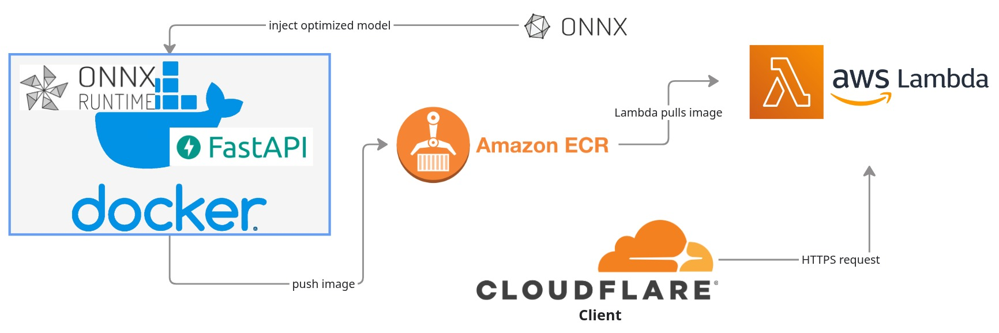

# Arabic Diacritizer - AWS Lambda Deployment

## <a href="https://arabic-diacritizer.abdallahsalahsalem9.workers.dev/">Live Demo</a>

A serverless Arabic text diacritization API powered by ONNX Runtime, deployed on AWS Lambda with a FastAPI interface



## Project Structure
├── app/ </br>
│ ├── infer.py # ONNX model inference logic</br>
│ ├── init.py # Python package marker</br>
│ ├── main.py # FastAPI application & Lambda handler</br>
│ └── model/</br>
│ ├── arabic_diacritizer.onnx # ONNX model graph</br>
│ └── arabic_diacritizer.onnx.data # Externalized model weights (39.7 MB)</br>
├── Dockerfile # Container configuration for Lambda</br>
├── event.json # Sample Lambda invocation event</br>
├── requirements.txt # Python dependencies</br>
└── README.md # This file</br>


## Local Development

### Prerequisites

- Python 3.12+
- Docker 
- AWS CLI 

### Setup Virtual Environment

```bash
python3 -m venv venv
source venv/bin/activate
pip install -r requirements.txt
```

### Run FastAPI Server Locally
```bash
uvicorn app.main:app --reload
```

### Health check
```bash
curl -X GET http://127.0.0.1:8000/
```

### Diacritization request
```bash
curl -X POST http://127.0.0.1:8000/predict \
  -H "Content-Type: application/json" \
  -d '{"text": "بسم الله الرحمن الرحيم مالك يوم الدين"}'
```
Example response
```
{
  "warning": null,
  "diacritized_text": "بِسْمِ اللَّهِ الرَّحْمَنِ الرَّحِيمِ مَالِكِ يَوْمِ الدِّينِ"
}
```
### Docker Testing (Lambda Simulation)
```bash
docker build --no-cache -t arabic-diacritizer-lambda .
```

### Run Lambda Locally with Runtime Interface Emulator (RIE)
```bash
docker run -p 9000:8080 arabic-diacritizer-lambda:latest
```

### Invoke the Lambda Function locally
```bash
curl -X POST "http://localhost:9000/2015-03-31/functions/function/invocations" \
  -d @event.json
```

## AWS Deployment

### Prerequisites
- AWS account with appropriate permissions
- AWS CLI configured (aws configure)


### Create ECR Repository (one time only)
```bash
aws ecr create-repository \
  --repository-name arabic-diacritizer-lambda \
  --region $REGION
```

### Build and Push Docker Image
```bash
export REGION="us-east-1"
export ACCOUNT_ID="526741672098"

aws ecr get-login-password --region=$REGION | docker login \
  --username AWS \
  --password-stdin $ACCOUNT_ID.dkr.ecr.$REGION.amazonaws.com

docker build --no-cache -t arabic-diacritizer-lambda:latest .

docker tag arabic-diacritizer-lambda:latest \
  $ACCOUNT_ID.dkr.ecr.$REGION.amazonaws.com/arabic-diacritizer-lambda:latest

docker push $ACCOUNT_ID.dkr.ecr.$REGION.amazonaws.com/arabic-diacritizer-lambda:latest
```

### Update Lambda Function
```bash
aws lambda update-function-code \
  --function-name arabic-diacritizer-lambda \
  --image-uri $ACCOUNT_ID.dkr.ecr.$REGION.amazonaws.com/arabic-diacritizer-lambda:latest \
  --region $REGION
```

### Test Deployment
```bash
curl -X POST https://your-lambda-url.lambda-url.us-east-1.on.aws/predict \
  -H "Content-Type: application/json" \
  -d '{"text": "السلام عليكم"}'
```

## Lambda Configuration
- Runtime: Python 3.12 (Container Image)
- Architecture: x86
- Memory: 1024 MB 
- Timeout: 10 seconds
- Handler: app.main.lambda_handler
- Function URL: Enabled with CORS
